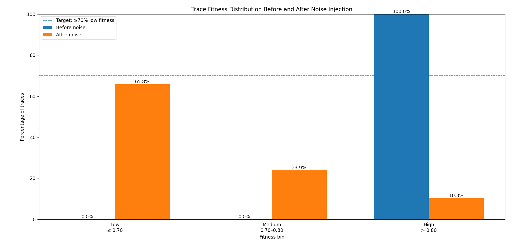

# XES Event Log Noise Injection & Dataset Splitting Toolkit

Command-line tools for **process-mining event logs** (XES format) that:

1. Compute **trace fitness** (token-based replay or alignments) against a Petri-net model (PNML).
2. **Inject controlled control-flow noise** to rebalance the fitness distribution.
3. Sample a **balanced dataset** and split it into train / validation / test sets (with the hardest traces reserved for the test set).

This is especially useful when the original log is heavily skewed toward high-fitness traces and you need more low-fitness (noisy / non-conforming) examples for downstream tasks (e.g. predictive process monitoring, conformance learning, robustness evaluation, etc.).

---

## Motivation & Result

Real-life event logs often contain almost exclusively high-fitness traces.  
After noise injection the distribution becomes much more useful for training/evaluation:



- **Before**: ~100 % high-fitness (> 0.80)
- **After** (example run): ~65.8 % low (≤ 0.70), ~23.9 % medium (0.70–0.80), ~10.3 % high (> 0.80)

Target proportions (configurable):
- **bin_1** (low): ≤ 0.70 → default 70 %
- **bin_2** (medium): 0.70 < fitness ≤ 0.80 → default 20 %
- **bin_3** (high): > 0.80 → default 10 %

---

## Requirements

- Python ≥ 3.8
- [pm4py](https://pm4py.fit.fraunhofer.de/) (and its dependencies)

```bash
pip install pm4py
```

Optional (for Petri-net visualization): Graphviz must be installed on the system.

---

## Quick Start

```bash
# 1. Annotate the original log with token-based-replay fitness
python tbr_xes.py \
  --xes-input  ./data/original_log.xes \
  --pnml-model ./models/model.pnml \
  --xes-output ./intermediate/log_with_fitness.xes

# 2. Inject noise to reach the desired fitness distribution
python noise_injection.py \
  --xes-input  ./intermediate/log_with_fitness.xes \
  --pnml-model ./models/model.pnml \
  --output-dir ./intermediate/noise_injection

# 3. (Optional) Create a smaller balanced subset
python sample_dataset_balanced.py \
  --xes-input  ./intermediate/noise_injection/balanced_noise_injected.xes \
  --output-dir ./processed/balanced \
  --bin1-count 300 --bin2-count 100 --bin3-count 100

# 4. Split into train / val / test (test set = hardest traces)
python split_dataset.py \
  --xes-input  ./processed/balanced/final_balanced_dataset.xes \
  --output-dir ./processed/splits
```

See the full workflow example further below.

---

## Scripts Overview

| Script | Purpose |
|--------|---------|
| `tbr_xes.py` | Token-based replay → adds `trace_fitness` & `is_fit` attributes |
| `align_based_fitness_xes.py` | Alignment-based fitness (more precise, slower) |
| `fitness_stats.py` | Compute & export fitness-bin statistics (CSV) |
| `noise_injection.py` | Controlled noise injection + rebalancing |
| `sample_dataset_balanced.py` | Subsample fixed counts per fitness bin |
| `split_dataset.py` | Stratified train/val/test split (hardest traces → test) |
| `viz_petri_net.py` | Visualize a PNML model as PNG |

---

### 1. Token-Based Replay (`tbr_xes.py`)

**Purpose:** Run token-based replay conformance checking on an XES log against a Petri net model.

**Usage:**
```bash
python tbr_xes.py \
  --xes-input <input.xes> \
  --pnml-model <model.pnml> \
  --xes-output <output.xes>
```

**Arguments:**
- `--xes-input` (required): Path to input XES event log file
- `--pnml-model` (required): Path to input PNML Petri net model file
- `--xes-output` (required): Path to output XES file with fitness metrics added

---

### 2. Alignment-Based Conformance (`align_based_fitness_xes.py`)

**Purpose:** Run alignment-based conformance checking (more accurate but computationally heavier).

**Usage:**
```bash
python align_based_fitness_xes.py \
  --xes-input <input.xes> \
  --pnml-model <model.pnml> \
  --xes-output <output.xes>
```

**Arguments:** same as `tbr_xes.py`.

---

### 3. Fitness Statistics (`fitness_stats.py`)

**Purpose:** Compute and save the fitness-bin distribution of a fitness-annotated XES log.

**Usage:**
```bash
python fitness_stats.py \
  --xes-input <input.xes> \
  --csv-output <output.csv>
```

**Fitness Bins:**
- `bin_1`: fitness ≤ 0.70
- `bin_2`: 0.70 < fitness ≤ 0.80
- `bin_3`: fitness > 0.80

---

### 4. Sample Balanced Dataset (`sample_dataset_balanced.py`)

**Purpose:** Build a final balanced dataset by subsampling a fixed number of traces from each fitness bin.

**Usage:**
```bash
python sample_dataset_balanced.py \
  --xes-input <input.xes> \
  --output-dir <output_directory> \
  [--bin1-count 300] [--bin2-count 100] [--bin3-count 100] \
  [--random-seed 42]
```

**Output:**
- `final_balanced_dataset.xes`
- `final_balanced_dataset_stats.csv`

---

### 5. Split into Train/Val/Test (`split_dataset.py`)

**Purpose:** Split a balanced dataset into train / validation / test sets.

**Strategy:**
- Test set contains the **hardest traces** (lowest fitness).
- Train and validation sets are stratified to preserve the fitness-bin proportions.

**Usage:**
```bash
python split_dataset.py \
  --xes-input <input.xes> \
  --output-dir <output_directory> \
  [--train-ratio 0.70] [--val-ratio 0.15] [--test-ratio 0.15] \
  [--test-fitness-threshold <float>] [--random-seed 42]
```

**Output:**
- `train.xes`, `val.xes`, `test.xes`
- `split_stats.csv`

---

### 6. Noise Injection (`noise_injection.py`)

**Purpose:** Inject control-flow noise into an XES log so that the resulting fitness distribution matches the desired target proportions.

**Noise operators (applied randomly):**
- **Skip** – remove an event
- **Insert** – add a random activity from the alphabet
- **Rework** – duplicate an event
- **Swap** – transpose two adjacent events

Severity is controlled by a noise percentage \(p\):  
number of edits ≈ \(\max(1, \mathrm{round}(p \times |\mathrm{trace}|))\).

Every candidate is re-evaluated with **real token-based replay** before acceptance.  
An iterative ladder of increasing noise levels + extra retries is used.

**Usage:**
```bash
python noise_injection.py \
  --xes-input <input.xes> \
  --pnml-model <model.pnml> \
  --output-dir <output_directory> \
  [--target-bin1 0.70] [--target-bin2 0.20] [--target-bin3 0.10] \
  [--sample-size 50000] \
  [--noise-levels 0.10,0.20,0.35,0.50,0.70,0.90,1.00] \
  [--extra-retries 6] [--random-seed 42]
```

**Output:**
- `balanced_noise_injected.xes`
- `balanced_noise_injected_stats.csv`

---

### 7. Visualize Petri Net (`viz_petri_net.py`)

**Purpose:** Render a PNML Petri net as a PNG image.

```bash
python viz_petri_net.py \
  --pnml-input <model.pnml> \
  --png-output <output.png>
```

---

## Complete Workflow Example

```bash
# Step 1 – Compute fitness
python tbr_xes.py \
  --xes-input ./raw_data/original_log.xes \
  --pnml-model ./models/split_miner_model.pnml \
  --xes-output ./intermediate/log_with_tbr_fitness.xes

# Step 2 – Inspect original distribution
python fitness_stats.py \
  --xes-input ./intermediate/log_with_tbr_fitness.xes \
  --csv-output ./stats/initial_fitness_distribution.csv

# Step 3 – Noise injection (rebalance)
python noise_injection.py \
  --xes-input ./intermediate/log_with_tbr_fitness.xes \
  --pnml-model ./models/split_miner_model.pnml \
  --output-dir ./intermediate/noise_injection \
  --target-bin1 0.70 --target-bin2 0.20 --target-bin3 0.10

# Step 4 – Verify new distribution
python fitness_stats.py \
  --xes-input ./intermediate/noise_injection/balanced_noise_injected.xes \
  --csv-output ./stats/balanced_fitness_distribution.csv

# Step 5 – Optional: create a fixed-size balanced subset
python sample_dataset_balanced.py \
  --xes-input ./intermediate/noise_injection/balanced_noise_injected.xes \
  --output-dir ./processed_data/balanced \
  --bin1-count 300 --bin2-count 100 --bin3-count 100

# Step 6 – Train / Val / Test split
python split_dataset.py \
  --xes-input ./processed_data/balanced/final_balanced_dataset.xes \
  --output-dir ./processed_data/splits \
  --train-ratio 0.70 --val-ratio 0.15 --test-ratio 0.15

# Step 7 – (Optional) Visualize the model
python viz_petri_net.py \
  --pnml-input ./models/split_miner_model.pnml \
  --png-output ./visualizations/model.png
```

---

## Getting Help

Every script supports `--help`:

```bash
python noise_injection.py --help
```
